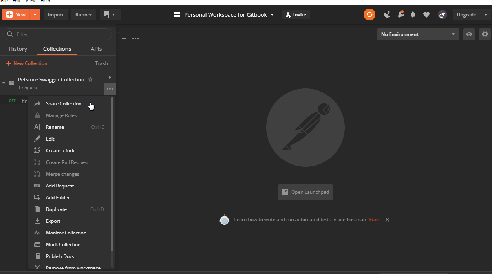

# Collections: An Overview

## What is a Collection?

* A Collection is a group of API requests.
* Requests can be stored and saved in a logical format inside a collection.
* Collections are crucial for performing advanced operations in Postman.

## Features of Collections

### _Authorization_

A single authorization method can be applied to multiple requests created inside a collection. 

### _Pre-request Script_

Any script written in this space will execute before every request is run inside this collection.

### _Tests_

In addition to requests, test scripts can also be written and run for each request in Collections. Scripts are executed after each request is run.


Tests allow us to ensure that our API is working as expected.

To establish that integrations between services are functioning reliably.

To verify that new developments haven't broken any existing functionality.

Test code can also be used to aid the debugging process when something goes wrong with our API project.


### _Variables_

Variables allow us to store and reuse values in requests and test scripts.


A stored variable can be referenced throughout collections, environments, and requests. 


### Folders

This is a right-click option for a Collection. One can segregate all GET requests in one folder for example. Similarly, all POST requests can be a part of another folder as shown below.

