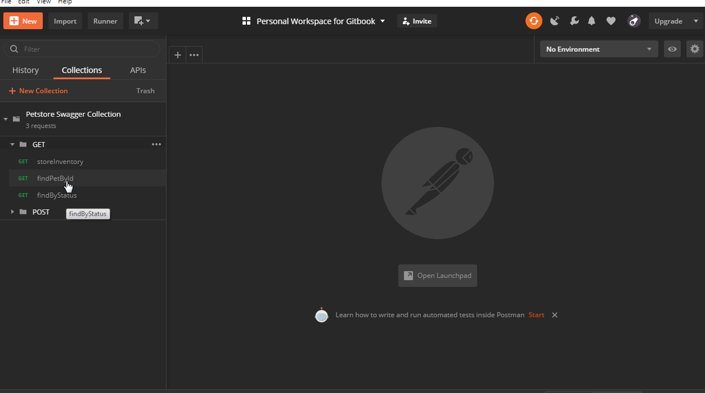
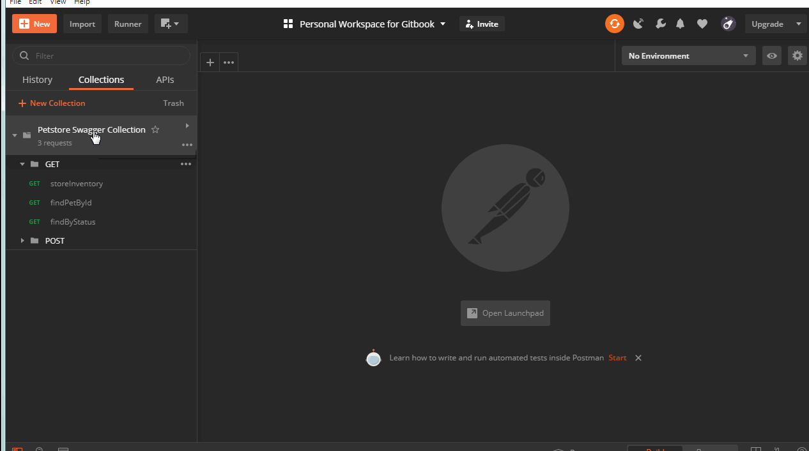
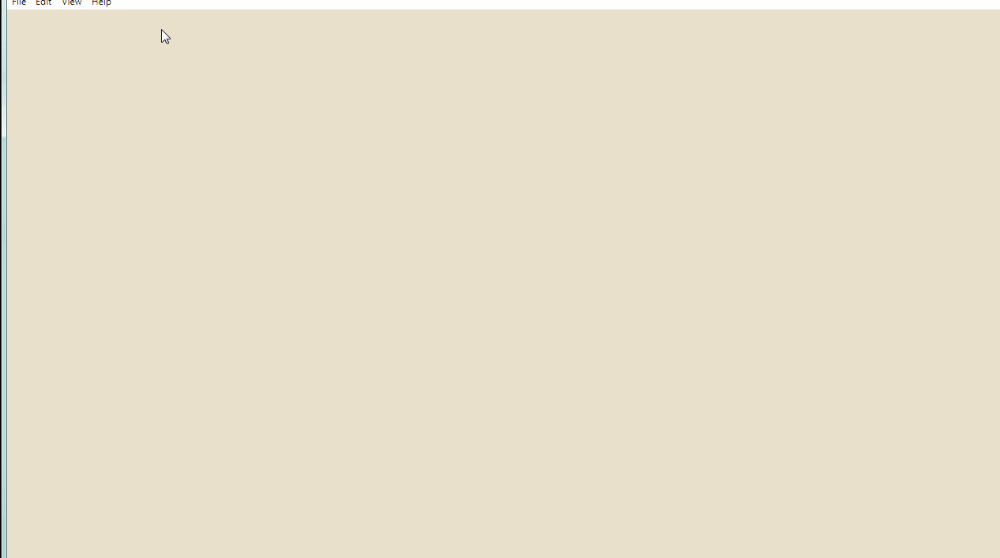
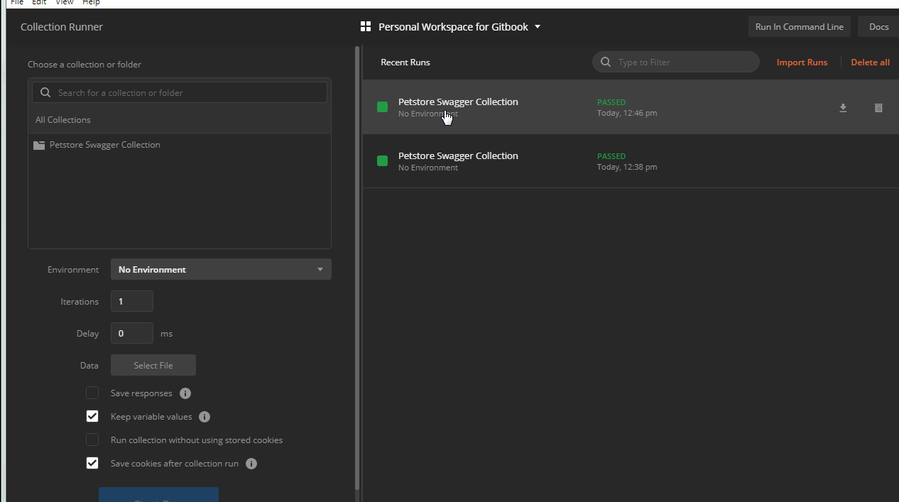

# Run a Collection

### Step 1: Create a collection and add few requests inside a collection.

In this example, I have added 3 GET requests inside a GET folder under Petstore Swagger Collection.

Once all requests are a part of Collection, click on Runner on the tool and wait for a new window to open.

In this window, we can select the collection we want to run, in this case, it is Petstore Swagger Collection. 

Then, click on the folder which is to be selected to run. The list of requests appear. The order in which these requests are run can be changed. 

The number of iteration for which requests should be run can be changed, here I have changed the iterations to 2. Also, a delay can be added to each request, if needed.

Finally, after the required settings are done, click on Run Petstore Swagger to run the collection.

Once a collection is run, there are various metrics shown on the screen for the selected run. The following are the options available.

1. Run Summary : Shows how many requests have passed or failed.
2. Export Results: The results can be exported to local drives.
3. Retry: The run can be executed again.
4. New: Selecting a new collection for the run.

