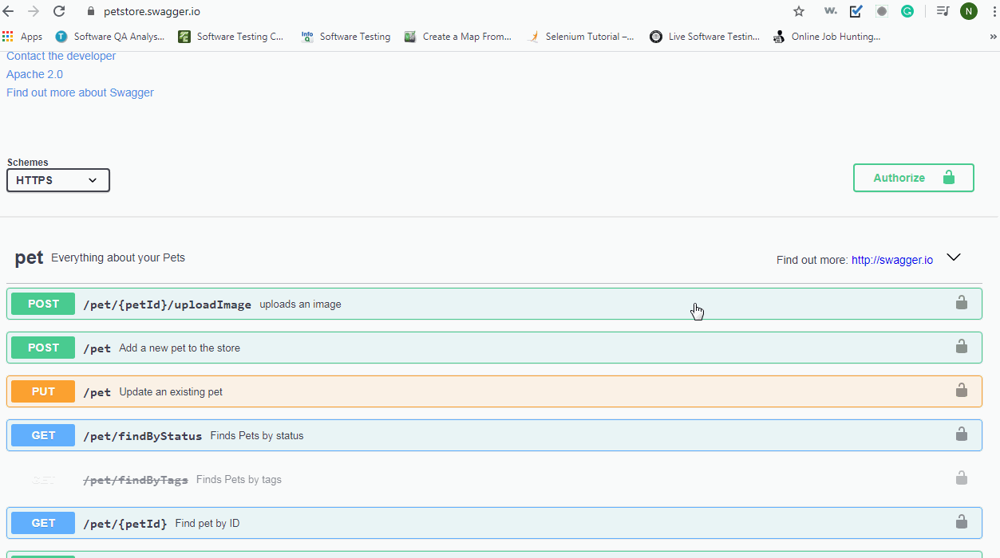
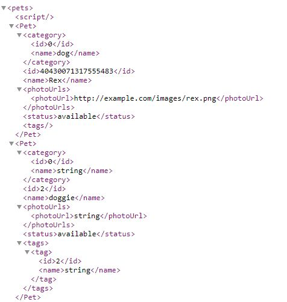
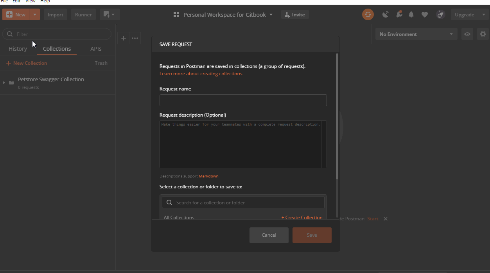

# Create API request and run

## Search for a sample rest API on the Internet.

I have picked the Petstore Swagger website.



Before starting anything on Postman, verify if the APIs are working fine by checking if the response is present or not.

Type [https://petstore.swagger.io/](https://petstore.swagger.io/) in the URL of a web browser followed by request tag, so that the request API becomes 



The response to the above request is similar to the one shown below.

Coming to the actual API request on Postman, let us see how to send this request on Postman to get the response as above.

1. Click on New -&gt; Request
2. Enter Request Name
3. Select a collection, in this case, I created a collection on the [Introduction](./) page.
4. Save to the collection.
5. Select GET verb on Postman and enter request API.
6. Click on Send.

