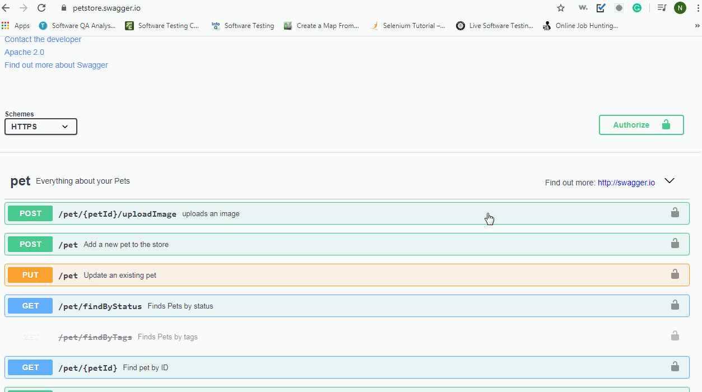
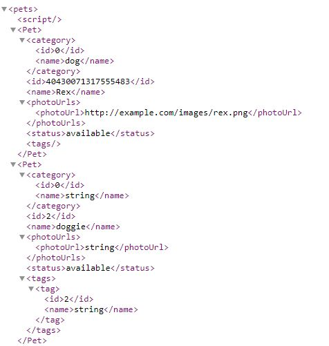
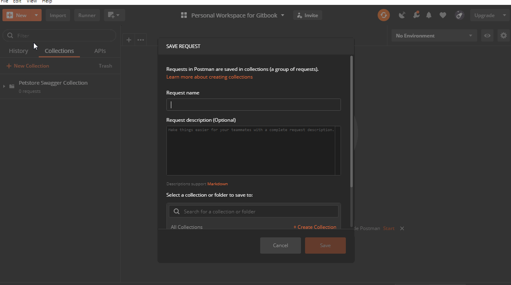

# API request and response usage

## Search for a sample rest API on the Internet.

I have picked the Petstore Swagger website.



Before starting anything on Postman, verify if the APIs are working fine by checking if the response is present or not.

Type https://petstore.swagger.io/v2/pet/findByStatus?status=available in the URL of a web browser 



The response to the above request is similar to the one shown below.

Coming to the actual API request on Postman, let us see how to send this request on Postman to get the response as above.

### GET request

1. Click on New -&gt; Request
2. Enter Request Name
3. Select a collection, in this case, I created a collection on the [Introduction](../) page.
4. Save to the collection.
5. Select GET verb on Postman and enter request API.
6. Click on Send.

### POST request

1. Click on New -&gt; Request
2. Enter Request Name
3. Select a collection, in this case, I created a collection on the [Introduction](../) page.
4. Save to the collection.
5. Select POST verb on Postman and enter request API.
6. Enter the body of the request as per the API description from the [Petstore Swagger](https://petstore.swagger.io/#/pet/addPet) website.
7. Enter the header of the request to include content-type = application/json.
8. Click on Send.

