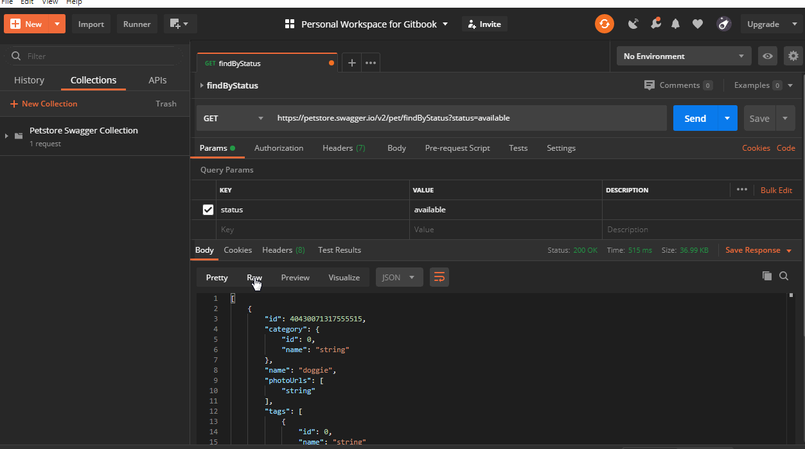
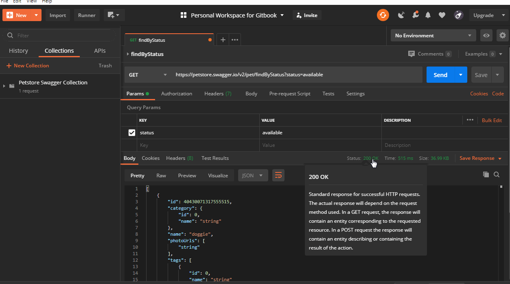
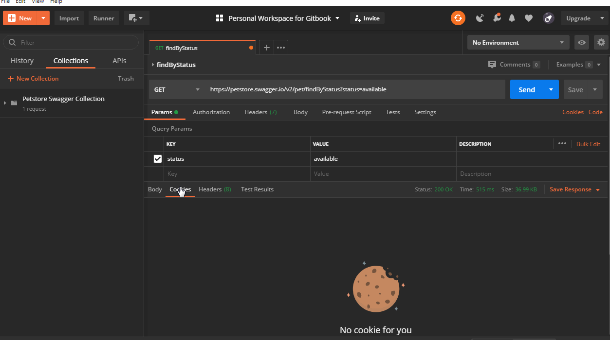

# Analyzing API response

## Response formats

Postman offers 4 kinds of formats to look at the response returned.

1. Pretty - looks awesome, readable
2. Raw - Machine formatted
3. Preview - Similar to Raw, but legible
4. Visualize - Add-on visualizers are required to view data. More on this later.

## Response Metrics

Postman offers 3 metrics to understand the response returned.

1. Status - 200 \(successful HTTP request\), 404 \(unknown HTTP request\)
2. Time - Shows in milliseconds, time for execution at each step
3. Size - Total size of response, body plus header

## Additional Information

Apart from Response formats and Response metrics, Postman also provides some additional information corresponding to responses.

1. Body - Shows the actual body of the response received from API call.
2. Cookies - Will be covered later
3. Headers - Shows information about headers such as Date, Server, content-type, etc.
4. Test Results - Will be covered later.

