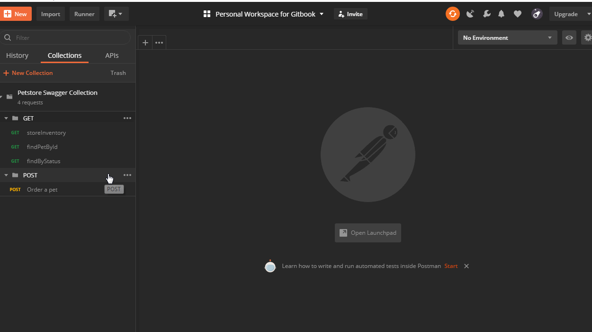

# Environment

An environment is a set of variables to use in Postman requests. 

Environments can be used to group related sets of values together and manage access to shared Postman data if working as part of a team.

### Add new request to demonstrate use of Environment.

