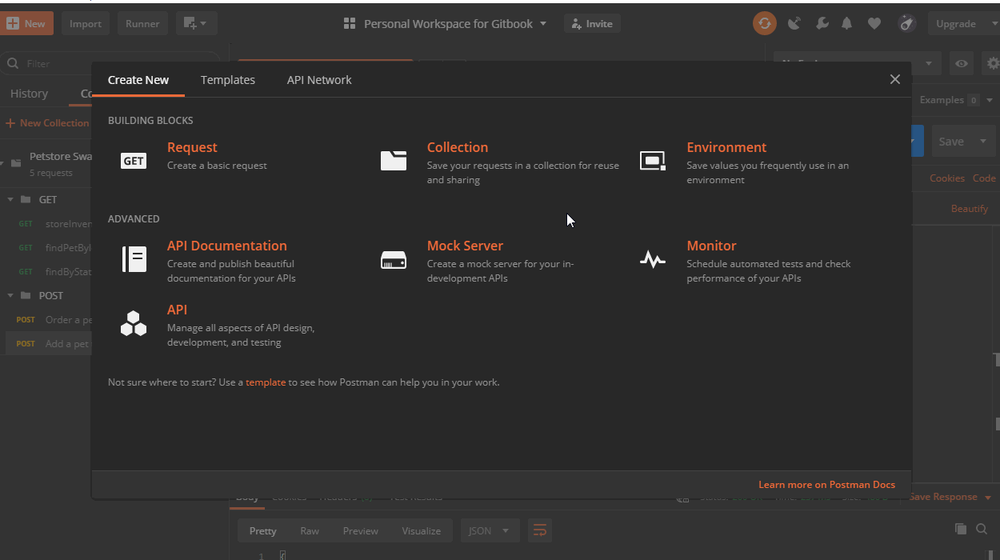
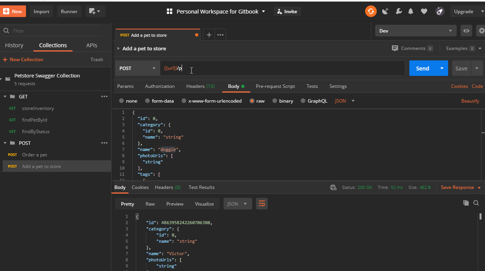
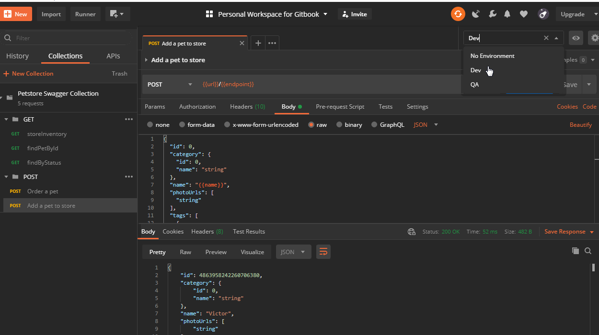

# Environment

An environment is a set of variables to use in Postman requests. 

Environments can be used to group related sets of values together and manage access to shared Postman data if working as part of a team.

### Create an Environment

1. Click on New -&gt; Environment\(QA\).
2. Add variables such as 'endpoint' and 'name'.
3. Enter their current values for this environment.
4. Click Add.
5. Click on Add again to add another Environment \(Dev\).
6. Add variables 'endpoint' and 'name'.
7. Enter their current values for this environment.
8. Click Add.
9. Close the window.

### Replace the values in scripts and request API with defined variables.

1. Replace /pet in endpoint with {{endpoint}}.
2. Replace "doggie" in the body of request with "{{name}}".
3. Select Environment \(Dev/QA\).

Save and run the request to find name of doggie replaced as per the selected Environment.

