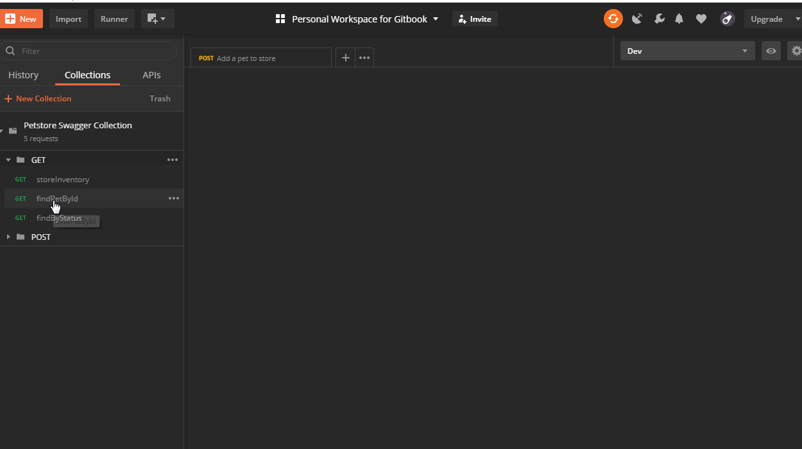
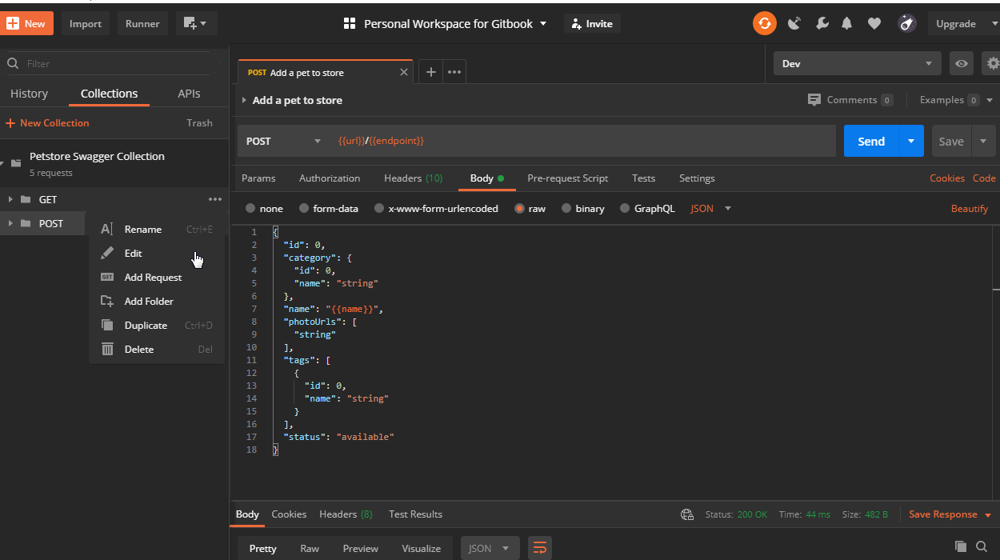
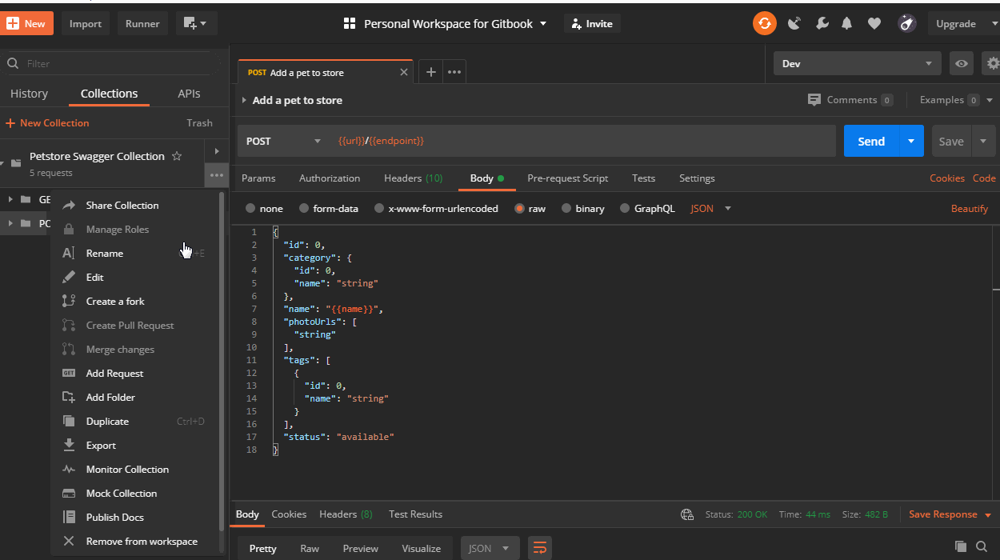
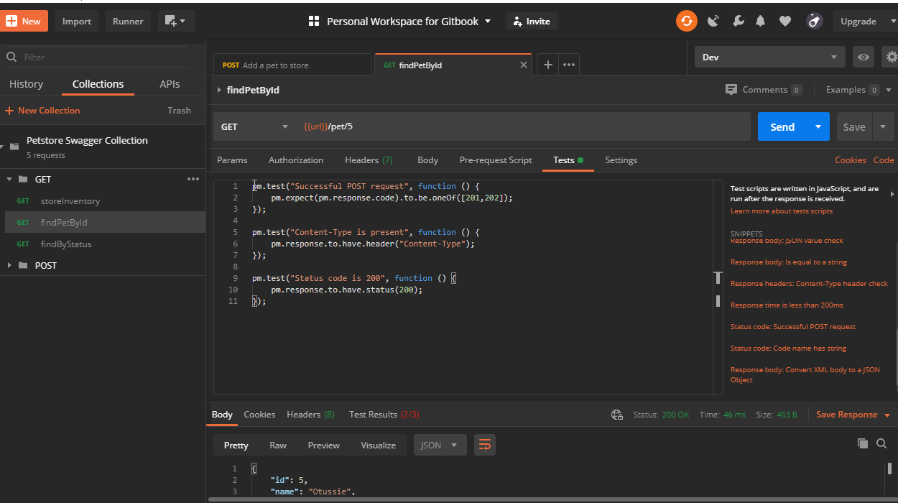

# Tests

In Postman, tests are executed after receiving the response from the server.

These tests are written in Javascript.

Tests can be written at request level, folder level or collection level as shown below.

### Sample execution of a test

