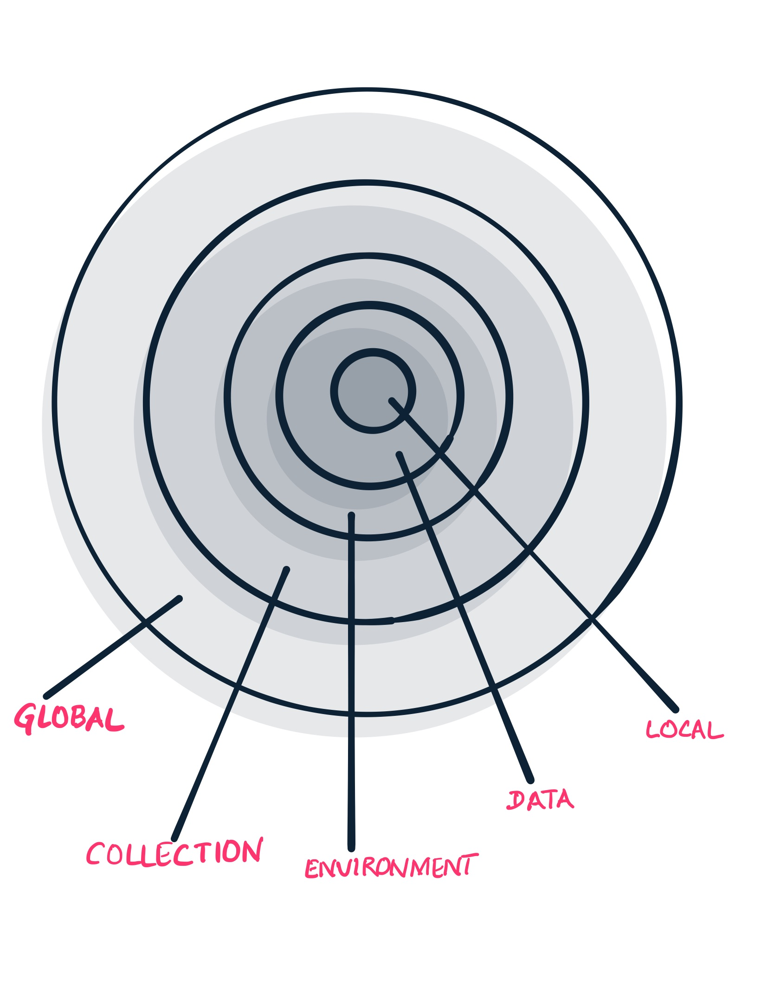

# Variables

A variable is a symbolic representation of data that allows us to access a value without having to enter it manually wherever we need it.

Variables in Postman are key-value pairs. Each variable name represents its key, so referencing the variable name allows us to access its value.

**Use:**

1. Using the same values in multiple places
2. Avoid repetition
3. Avoid re-work when value changes

**Supported Scopes:**


If a variable with the same name is declared in two different scopes, the value stored in the variable with narrowest scope will be used**.**


Variable scopes are suited to different tasks in Postman:

* **Global variables** allow you to access data between collections, requests, test scripts, and environments. Global variables are available throughout a workspace. {**Use sparingly to avoid confusion**}.
*  **Collection variables** are available throughout the requests in a collection and are independent of environments, do not change based on the selected environment. {**Suitable if using a single environment only**}.
*  **Environment variables** allow to tailor processing to different environments. Only one environment can be active at a time. {**Help specify role-based access levels**}.
*  **Local variables** are temporary, and only accessible in request scripts. Local variable values are scoped to a single request or collection run, and are no longer available when the run is complete. {**Local variables are suitable if a value is needed to override all other variable scopes but do not want the value to persist once execution has ended**}.
* **Data variables** come from external CSV and JSON files to define data sets one can use when running collections via Newman or the Collection Runner.

