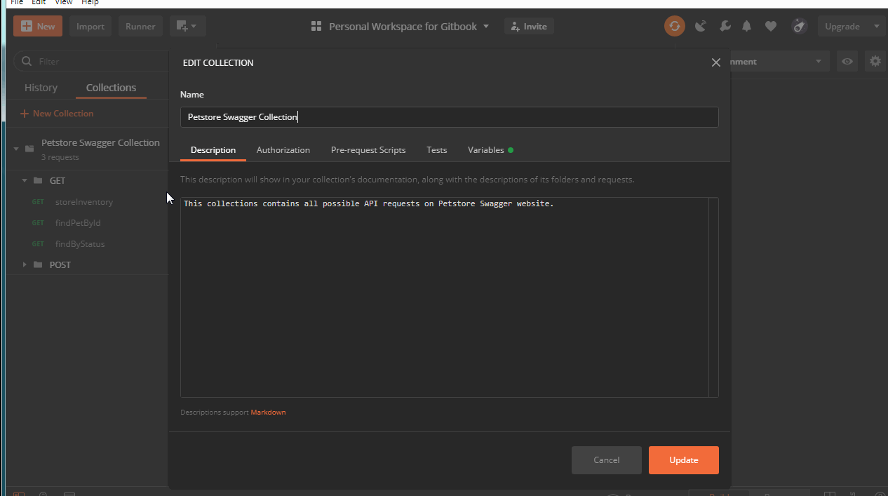

# Creating and referring Variables

### Setting variables at the Collection level

1. Right Click Collection -&gt; Petstore Swagger Collection
2. Click Edit
3. Click on Variables
4. Enter Variable name = url and current value = "[https://petstore.swagger.io/v2](https://petstore.swagger.io/v2)"
5. Click Update
6. Replace request API with the defined variable.
7. Click Send to get response API.

This variable is used inside all requests in the GET folder. Hence, all requests in this folder can be replaced to use the url variable as shown below.

### Setting variables at the Environment level

1. Click on Manage Environments button.
2. Click on Globals to create a global variable.
3. Add required variables and their values and click Save.
4. Close Manage Environments.
5. Click on Environment Quick Looks to check the global variables defined.

