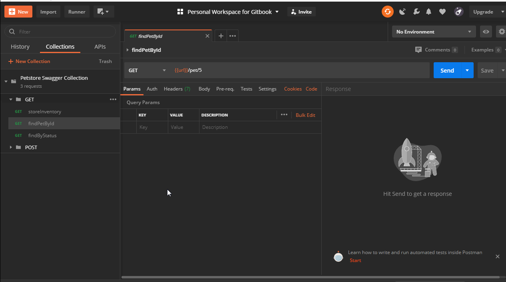
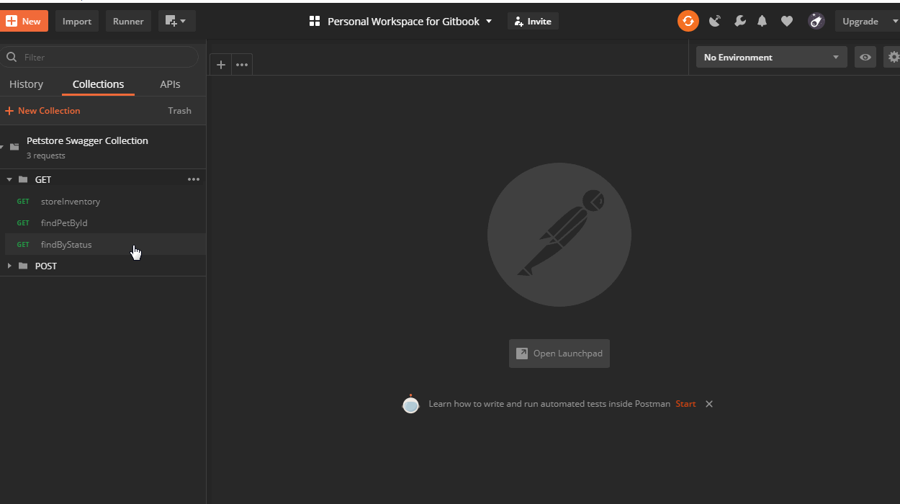
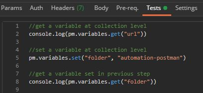
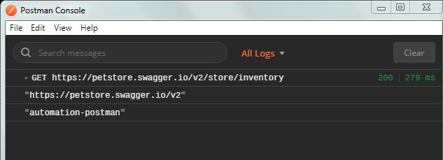

# Set and Get Variables at Collection Level

Scripts can be written inside individual requests inside a Collection as shown below. Scripts written here will execute only for the particular request where it is specified.



Scripts can also be written inside a Collection itself instead of individual requests. Scripts written here will execute once for each request.




Instead of writing scripts in the Tests tab, scripts can also be written in the Pre-requests Scripts tab of requests/Collection.


### Get variables at the Collection level.

```text
pm.variables.get("url")
```

### Set variables at the Collection level.

```text
pm.variables.set("folder", "automation-postman")

console.log(pm.variables.get("folder"))
```





